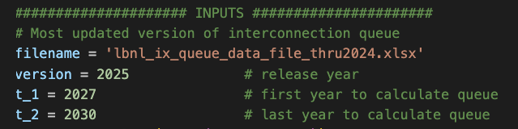
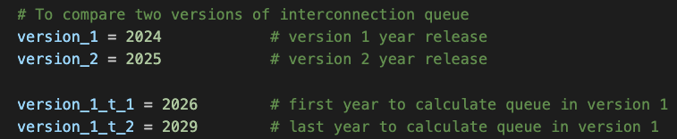

# Overview
This repo includes scripts and inputs to preprocess interconnection queues that are used to run ReEDS 2.0.

# Scripts
- Script is run in `process_interconnection_queues.py`
- This script takes original interconnection queue data file from LBNL:
    - Determine cumulative queues between 2 years at FIPS level by technology
    - First year (`t_1`) cumulative queues: `q_status = ‘active’` and `IA_status_clean = ‘IA Executed’`
    - Final year (`t_2`) cumulative queues: `q_status = ‘active’` regardless of `IA_status_clean` status
    - Cumulative values for all the years in between `t_1` and `t_2` are interpolated from these two years' values
    - To run the script, a filename of the most recent data version, version release year and `t_1` and `t_2` are required

# Input files and params to run process_interconnection_queues.py
All the input files to run the scripts are located in `inputs` folder, including original queue data from LBNL (most recently `lbnl_ix_queue_data_file_thru2024.xlsx`) and county2zone file (read from ReEDS-2.0 repo) to match ReEDS counties to appropriate bas.

# Output
- Located in the `outputs` folder
- Final file that will be used to run ReEDS-2.0: `interconnection_queues.csv`
- Previous version files are also kept there

# Comparison figures
- Interconnection queue figures for 2 versions of queue data can be generated from `process_interconnection_queues.py` by setting the versions' release years and the first and last years that cap limit is applied for the two versions
  

