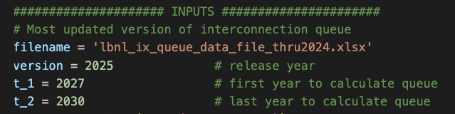
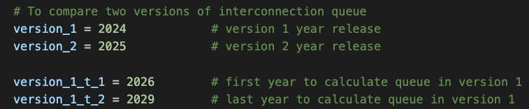

# Overview
This repo includes scripts and inputs to preprocess interconnection queues that are used to run ReEDS 2.0.

# Scripts
- Script is run in `process_interconnection_queues.py`
- This script takes original interconnection queue data file from LBNL:
    - Determine cumulative queues between 2 years at FIPS level by technology
    - First year (`t_1`) cumulative queues: `q_status = ‘active’` and `IA_status_clean = ‘IA Executed’`
    - Final year (`t_2`) cumulative queues: `q_status = ‘active’` regardless of `IA_status_clean` status
    - Cumulative values for all the years in between `t_1` and `t_2` are interpolated from these two years' values
    - To run the script, a filename of the most recent data version, version release year and `t_1` and `t_2` are required

# Input files and params to run process_interconnection_queues.py
All the input files to run the scripts are located in `inputs` folder, including original queue data from LBNL (most recently `LBNL_Ix_Queue_Data_File_thru2025.xlsx`), the supplemental resource-type file from LBNL (`queues_other_forNLR_2025.xlsx`, see below) and the county-to-state file (read from the ReEDS repo at `inputs/zones/county_state.csv`) to match ReEDS counties to appropriate bas. Point the script at your ReEDS checkout with the `REEDS_PATH` environment variable.

Note: starting with the 2025 data vintage, LBNL renamed several columns (`IA_status_*` &rarr; `IA_phase_*`, `type1`/`mw1` &rarr; `type_1`/`mw_1`) and folded the less-common resource types into the aggregated `Other`/`Other Storage` categories.

## Supplemental resource types (`queues_other_forNLR_2025.xlsx`)
Because `Pumped Storage` is folded into `Other Storage` and `Biofuel`/`Biomass` into `Other` in the public 2025 file, the `pumped-hydro` and `biomass` tech groups would otherwise disappear from the output. LBNL sent us a supplement listing the detailed resource type for every *active* request in those aggregated categories (biofuel, biomass, pumped storage, compressed air, hydrogen, wave and waste heat).

`process_interconnection_queues.py` merges it back in before anything else happens:
- Requests are matched on `q_id` + `entity`, since a `q_id` is only unique within an interconnecting entity
- For hybrid / co-located requests the supplement reports its own `type1`/`type2`/`type3`, but *not* in the same order as the public file's `type_1`/`type_2`/`type_3`. Each detailed type is therefore matched to the aggregated category it was folded into (`Pumped Storage`/`Compressed Air` &rarr; `Other Storage`; `Biofuel`/`Biomass`/`Waste Heat`/`Wave` &rarr; `Other`) rather than by position
- Capacities always come from the public file; the supplement is only used to relabel the resource type
- `compressed air`, `waste heat` and `wave` have no matching ReEDS tech group, so they are still dropped
- The script prints how many requests it relabeled and lists any supplement record with no matching request in the public file (5 records for the 2025 vintage, 3 of which are 0 MW)

To use a new vintage of the supplement, update `filename_other` at the top of the script; set it to `None` for vintages that don't need it.

# Output
- Located in the `outputs` folder
- Final file that will be used to run ReEDS: `interconnection_queues.csv`
- Previous version files are also kept there

# Comparison figures
- Interconnection queue figures for 2 versions of queue data can be generated from `process_interconnection_queues.py` by setting the versions' release years and the first and last years that cap limit is applied for the two versions
  

